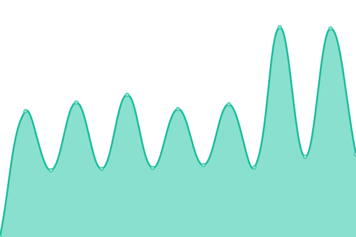

# [📈 Live Status](https://pierstoval.github.io): <!--live status--> **🟧 Partial outage**

This repository contains the open-source uptime monitor and status page for [Alex Rock](https://alex-rock.tech/en), powered by [Upptime](https://github.com/upptime/upptime).

With [Upptime](https://upptime.js.org), you can get your own unlimited and free uptime monitor and status page, powered entirely by a GitHub repository. We use [Issues](https://github.com/pierstoval/my_upptime/issues) as incident reports, [Actions](https://github.com/pierstoval/my_upptime/actions) as uptime monitors, and [Pages](https://pierstoval.github.io) for the status page.

<!--start: status pages-->
<!-- This summary is generated by Upptime (https://github.com/upptime/upptime) -->
<!-- Do not edit this manually, your changes will be overwritten -->
<!-- prettier-ignore -->
| URL | Status | History | Response Time | Uptime |
| --- | ------ | ------- | ------------- | ------ |
|  [alex-rock.tech](https://alex-rock.tech/en/) | 🟩 Up | [alex-rock-tech.yml](https://github.com/Pierstoval/my_upptime/commits/HEAD/history/alex-rock-tech.yml) | 

 569ms
     
 | 

<a href="https://Pierstoval.github.io/my_upptime/history/alex-rock-tech">100.00%</a>
    

|  [www.orbitale.tech](https://www.orbitale.tech/) | 🟩 Up | [www-orbitale-tech.yml](https://github.com/Pierstoval/my_upptime/commits/HEAD/history/www-orbitale-tech.yml) | 

 306ms
     
 | 

<a href="https://Pierstoval.github.io/my_upptime/history/www-orbitale-tech">100.00%</a>
    

|  [stars.pierstoval.com](https://stars.pierstoval.com/) | 🟩 Up | [stars-pierstoval-com.yml](https://github.com/Pierstoval/my_upptime/commits/HEAD/history/stars-pierstoval-com.yml) | 

 636ms
     
 | 

<a href="https://Pierstoval.github.io/my_upptime/history/stars-pierstoval-com">100.00%</a>
    

|  [wiki dragons](https://dragons.pierstoval.com/) | 🟩 Up | [wiki-dragons.yml](https://github.com/Pierstoval/my_upptime/commits/HEAD/history/wiki-dragons.yml) | 

 1047ms
     
 | 

<a href="https://Pierstoval.github.io/my_upptime/history/wiki-dragons">100.00%</a>
    

|  [wiki esteren](https://esteren.pierstoval.com/) | 🟩 Up | [wiki-esteren.yml](https://github.com/Pierstoval/my_upptime/commits/HEAD/history/wiki-esteren.yml) | 

 977ms
     
 | 

<a href="https://Pierstoval.github.io/my_upptime/history/wiki-esteren">100.00%</a>
    

|  [esterenmaps](https://esterenmaps.pierstoval.com/) | 🟩 Up | [esterenmaps.yml](https://github.com/Pierstoval/my_upptime/commits/HEAD/history/esterenmaps.yml) | 

 745ms
     
 | 

<a href="https://Pierstoval.github.io/my_upptime/history/esterenmaps">100.00%</a>
    

|  [corahnrinv1](https://jdr.pierstoval.com/esteren/) | 🟥 Down | [corahnrinv1.yml](https://github.com/Pierstoval/my_upptime/commits/HEAD/history/corahnrinv1.yml) | 

 7959ms
     
 | 

<a href="https://Pierstoval.github.io/my_upptime/history/corahnrinv1">92.30%</a>
    

|  [corahnrinv2](https://corahnrin.pierstoval.com/) | 🟩 Up | [corahnrinv2.yml](https://github.com/Pierstoval/my_upptime/commits/HEAD/history/corahnrinv2.yml) | 

 512ms
     
 | 

<a href="https://Pierstoval.github.io/my_upptime/history/corahnrinv2">100.00%</a>
    

|  [corahnrinv2](https://corahnrin.pierstoval.com/) | 🟩 Up | [corahnrinv2.yml](https://github.com/Pierstoval/my_upptime/commits/HEAD/history/corahnrinv2.yml) | 

 512ms
     
 | 

<a href="https://Pierstoval.github.io/my_upptime/history/corahnrinv2">100.00%</a>
    

<!--end: status pages-->

[**Visit our status website →**](https://pierstoval.github.io)

## 📄 License

- Powered by: [Upptime](https://github.com/upptime/upptime)
- Code: [MIT](./LICENSE) © [Alex Rock](https://alex-rock.tech/en)
- Data in the `./history` directory: [Open Database License](https://opendatacommons.org/licenses/odbl/1-0/)
